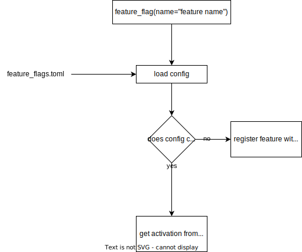

# Features

```gherkin
--8<-- "features/simple_flag.feature"
```

---

```gherkin
--8<-- "features/named_feature_flag.feature"
```

---

```gherkin
--8<-- "features/feature_config_file.feature"
```



---
